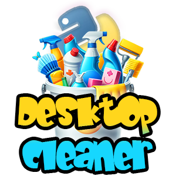

# Desktop Cleaner



## Description

Feeling overwhelmed by a cluttered desktop? Introducing Desktop Cleaner, your friendly Python companion on the path to organizational bliss!

This is my very first Python project, designed to help you sort and manage your files with ease. By default, it tackles the ever-growing abyss that can be your desktop, but feel free to unleash its power on any folder by simply changing a variable. Let Desktop Cleaner be your first step into the exciting world of Python programming and say goodbye to desktop chaos forever!

## Installation

- Step 1: Clone the Repo here:

[Repo Link](git@github.com:8BitGinger/desktopCleaner.git)

- Step 2: Open the File called:
  desktop_cleaner.py

- Step 3: Change the folder_path Variable:

```
folder_path = '/Users/ryanf/Downloads'
```

- Step 4: Open Terminal and Navigate to Folder

- Step 5: Run the following command:

```
  python desktop_cleaner.py

```

## Screenshots


## Links

[Landing Page]()

[Repo]()

[My Portfolio]()

## Credits

Tutorial:

[Internet Made Coder - Youtube](https://www.youtube.com/watch?v=4TZ1K8EHT2M)

Demo Video Music:

[Monoway Music](https://pixabay.com/users/monowaymusic-33794461/)

## Contact

[Gmail](mailto:ryan.fann@gmail.com)

[GitHub](https://github.com/8BitGinger)

[My Portfolio](https://ryanfann.netlify.app/)
